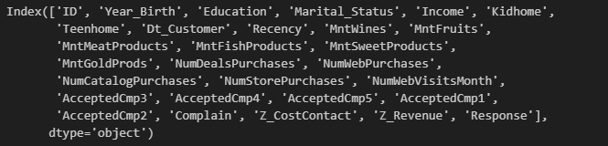
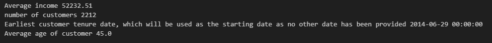
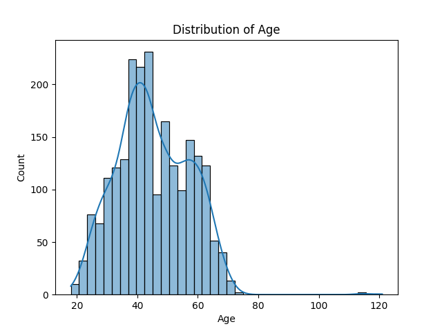
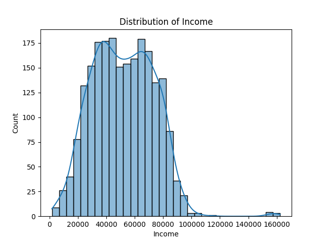
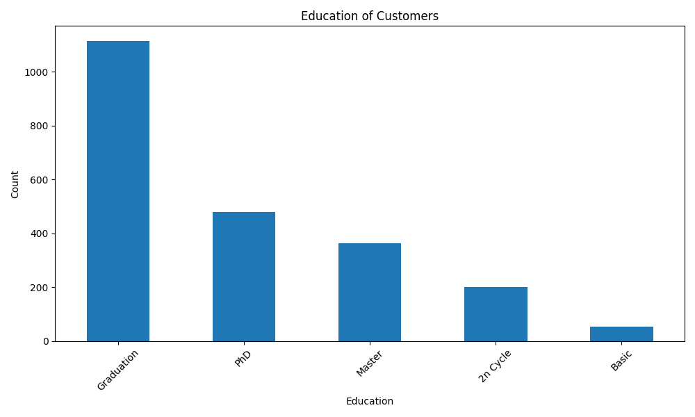
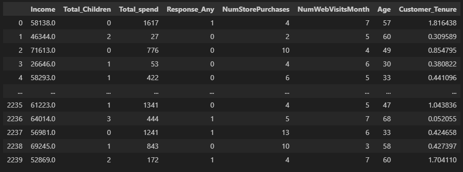
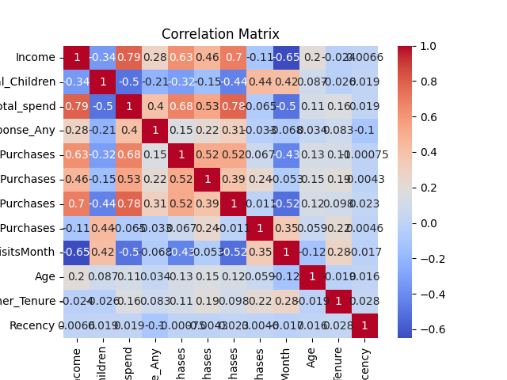
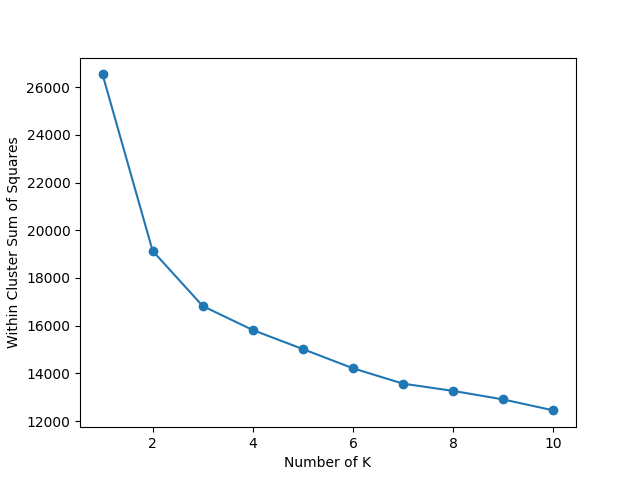
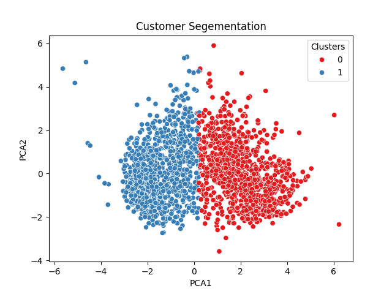
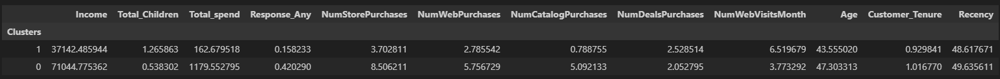

# Segmentation model using K means clustering

## 1. Purpose 

The purpose of this model is to be able for a company to seperate their customers into segments based on historical data. These groups will connect demographic and online behaviour/activity with spending habits allowing a company to offer a customer a tailored value proposition/ product selection based on the demographic/ behavioural aspects observed ,increasing the expected conversion of leads. The selection of variables will be based on Recency, Frequency and Monetary values which have been proven to be powerful characteristics for segmenting based on [customer behaviour and value](https://www.researchgate.net/publication/392017535_Using_RFM_Analysis_to_Predict_High-_Value_Customers).   

## 2. Detailing the environment/ Loading the data

https://www.kaggle.com/datasets/vishakhdapat/customer-segmentation-clustering?resource=download

The data used is artificial customer data for a grocery store. It has both physical and online data. The initial data set contained 2240 data points. After cleaning and formating the data there were 2211 customer profile records, with customers who had intially used the service from 2012-07 to 2014-06.The customers average age group is 45 with an average income of $52,232.51.  

## 3. Data Columns and Explorations

# 4. Feature Engineering

Created total children variables

Created total spending for variable by summing up all product expenditure

Created total campaign responses from all campaigns

# Correlation Matrix

# K means algorithm
Analysing the elbow diagram we can tell that 2 clusters will allow for the smallest sum of squares on average per cluster. Allowing for most well defined groupings for the dataset.

# K equalling 

